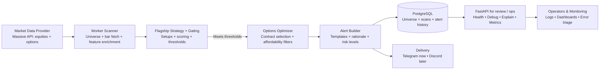

# AI Trader — Market Intelligence & Trade Alerts

AI Trader is an AI-first intelligence engine that scouts liquid markets, scores setups like a confident discretionary trader, and publishes trade-ready alerts. Delivery is channel-agnostic: Telegram is just one distribution path alongside Discord, webhooks, or dashboards.

## Overview
- Curates a universe of high-volume stocks and ETFs for clean execution.
- Evaluates bullish and bearish setups with context-aware scoring and confirmation logic.
- Chooses between options and stock-only framing based on liquidity, cost, and clarity of risk.
- Publishes lifecycle alerts: Trade Idea, I'M IN, and I'M OUT.
- Keeps risk defined with explicit entries, stops, targets, and trade states.

## System Architecture & Intelligence Flow
```
Market Data (Massive)
        ↓
Universe Builder (Liquidity + Volume)
        ↓
Signal Intelligence Engine (Context + Scoring)
        ↓
Instrument Selection (Options vs Stock)
        ↓
Trade Lifecycle Manager (Watching → In → Out)
        ↓
Distribution Channels (Telegram, Discord, Webhook)
```

- **Market Data (Massive):** Streams option and equity snapshots as the factual base for every decision.
- **Universe Builder:** Filters to liquid, high-volume names so downstream signals have tight spreads and depth.
- **Signal Intelligence Engine:** Scores setups with contextual features (trend, momentum, structure) to mirror a confident discretionary trader.
- **Instrument Selection:** Chooses between options and stock based on liquidity, spreads, moneyness, and quality of fills.
- **Trade Lifecycle Manager:** Manages state transitions from watching → I'M IN → I'M OUT while keeping stops and targets explicit.
- **Distribution Channels:** Delivers finished intelligence to Telegram, Discord, or webhooks. Delivery is modular; the core product is the decision engine.

## System Architecture (Technical Overview)


- **Market Data Provider (Massive API):** Pulls consolidated equity and options data to feed all downstream calculations without channel coupling.
- **Worker Scanner:** Builds the liquid universe, fetches bars, and enriches them with VWAP, EMA, RSI, Bollinger Bands, ATR, and volatility ratios so detectors operate on curated features.
- **Flagship Strategy + Gating:** Runs setup detectors, applies scoring and thresholds, and enforces AI-driven gating instead of delivery-driven rules to decide if a ticker is viable.
- **Options Optimizer:** Picks contracts with affordability and quality filters (DTE bounds, spread %, open interest/volume, moneyness) to keep fills realistic.
- **Alert Builder:** Formats ALERT_STYLE templates with rationale, risk levels, and decision context before handing off to persistence and delivery.
- **PostgreSQL:** Stores the tracked universe, scan snapshots, and alert history for reproducibility and operator audits.
- **Delivery:** Sends alerts to Telegram today with a clean path to Discord or other channels later; distribution is separate from intelligence.
- **FastAPI for review / ops:** Exposes health, debug, explainability, and metrics endpoints so operators can interrogate the pipeline.
- **Operators & Monitoring:** Consumes logs, dashboards, and error triage hooks to keep runs healthy and observable.

**Why this architecture works:** Governance levers (scores, thresholds, governor env vars), throttles, and cooldowns prevent noisy outputs; every step persists to Postgres for reproducibility; and FastAPI/ops endpoints let operators audit, pause, or rerun flows without touching delivery channels.

### Architecture Notes
- Data normalization layer reconciles Polygon-like fields with Massive fields before feature enrichment.
- All surfaced timestamps are formatted in Eastern Time as `MM-DD-YYYY HH:MM AM/PM ET` for consistency across alerts and dashboards.
- Governance environment variables: `MAX_TICKERS_PER_RUN`, `MAX_RUNTIME_SECONDS`, `MAX_ALERTS_PER_RUN`, `ALERT_COOLDOWN_MINUTES`, `MIN_SIGNAL_SCORE` keep scans bounded and repeatable.
- Telegram enable switch: `TELEGRAM_ENABLED` guards delivery; the intelligence layer remains channel-agnostic.

## What the system does
- Scans top-volume stocks and ETFs for high-conviction trade ideas.
- Generates CALL and PUT option plans when contracts are liquid and fairly priced.
- Falls back to stock-only framing when options fail affordability or liquidity checks.
- Defines entry, stop, and target levels for every idea and tracks lifecycle events.
- Publishes alerts to interchangeable channels (Telegram, Discord, webhook, etc.).

## Alert Formats (Trader-grade)
All timestamps surface as `MM-DD-YYYY HH:MM AM/PM ET`. Examples below use the standardized templates delivered to Telegram (or any other channel).

Stock Trade Idea
```
🚨 TRADE IDEA — AMD (STOCK)

Direction: Long
Market Context: pullback

Entry: 154.20
Stop: 150.80  (3.40 risk)
Targets:
• T1: 158.00
• T2: 162.50

Why stock over options:
• Options premiums elevated or expensive
• Spread/liquidity not ideal
• Cleaner risk with shares

Execution Plan:
Respect the stop and scale only at targets.

Timestamp: 06-14-2024 09:32 AM ET
```

Options Trade Idea
```
🚨 TRADE IDEA — NVDA (CALL)

Underlying: 118.50
Setup: breakout
Confidence: 8.8/10

Contract:
• NVDA 120.00C
• Exp: 06-21-2024
• Mid: 2.45
• Bid/Ask: 2.35 / 2.55
• OI/Vol: 68420 / 12500
• Spread: 8.2%

Plan:
Entry: 2.45
Stop: 2.05
Targets: 3.10 → 3.60
Notes: Watch volume and respect stops.

Timestamp: 06-14-2024 09:30 AM ET
```

I'M IN (follow-up)
```
✅ I'M IN — AMD (STOCK)
Fill: 154.30
Risk: 150.80 (hard stop)
Plan: Trade live. Hard stop stays in.
Timestamp: 06-14-2024 09:45 AM ET
```

I'M OUT (follow-up)
```
🏁 I'M OUT — AMD (CALL)
Exit: 158.00
Result: 12.0% (0.18)
Reason: target hit
Timestamp: 06-14-2024 11:15 AM ET
```

## Environment Variables & Tuning
Telegram is one delivery channel; the core product is AI signal intelligence. Defaults in parentheses.

- `ENABLE_RTH_ONLY` (true) — when true, alerts only publish between 9:30 AM–4:00 PM ET.
- `ENABLE_FOLLOW_UP_ALERTS` (false) — auto-send I'M IN / I'M OUT lifecycle alerts when trades update.
- `ALERTS_ENABLED` (true) — master switch for emitting alerts.
- `TELEGRAM_ENABLED`, `TELEGRAM_BOT_TOKEN`, `TELEGRAM_CHAT_ID` — Telegram delivery controls.
- `DATABASE_URL` — backing database for trades and events.
- `UNIVERSE_SIZE` (20) — how many tickers to evaluate each run.
- `MAX_TICKERS_PER_RUN` (250) — cap on how many symbols `/scan/day` will process before exiting.
- `MAX_RUNTIME_SECONDS` (40) — runtime guardrail for `/scan/day` based on wall-clock seconds.
- `MAX_ALERTS_PER_RUN` (3) — how many alerts `/scan/day` can emit in one invocation.
- `ALERT_COOLDOWN_MINUTES` (15) — suppress alerts for tickers alerted within this cooldown window.
- `MIN_SIGNAL_SCORE` (78.0 by default) — minimum score for a setup to alert; accepts whole numbers or floats.
- `MAX_ALERTS_PER_TICKER_PER_DAY` (3) and `COOLDOWN_MINUTES` (30) — governor limits for repeated alerts.
- `OPT_MAX_MONEYNESS_PCT` (0.12), `OPT_MAX_SPREAD_PCT` (0.20), `OPT_MIN_DTE` (5), `OPT_MAX_DTE` (21), `OPT_MIN_VOLUME` (50), `OPT_MIN_OI` (200) — option selection guards.
- `OPT_MAX_SPREAD_PCT`, `OPT_MAX_MONEYNESS_PCT` combine with `OPT_CALL_DELTA_*` and `OPT_PUT_DELTA_*` to fence contract quality.
- `ALERT_STYLE` — short/medium/deep copy tone.
- `DEBUG_ENDPOINTS_ENABLED` (false) — enables debug-only HTTP endpoints.
- `MASSIVE_API_KEY`, `MASSIVE_BASE_URL` — Massive API auth (Authorization: Bearer <key>).

## Endpoints
- `GET /health` — Liveness and DB connectivity check.
- `GET /preflight` — Returns key configuration flags and DB connectivity status.
- `POST /scan/day` — Runs the day scan and pushes the top alert candidate.
- `POST /state/update` — Advances trade states and sends I'M IN or I'M OUT alerts.
- `POST /universe/rebuild` — Rebuilds the ticker universe for future scans.
- `POST /test/telegram` — Sends a test message to verify Telegram delivery.
- `POST /debug/force-alert` — Debug-only hook to run the `/scan/day` pipeline for a single ticker.
- `POST /debug/preview-alert` — Debug-only endpoint to send a preview of the real alert formatter for a ticker.
- `GET /debug/explain` — Returns a dry-run explanation of a single ticker without sending Telegram.

### Using `/debug/force-alert`
- Enable via `DEBUG_ENDPOINTS_ENABLED=true` (403 otherwise).
- Query params:
  - `ticker` (required)
  - `min_score_override` (optional float) to override `MIN_SIGNAL_SCORE` for this call only.
  - `dry_run` (optional bool, default `false`) — when true, returns the alert payload without sending Telegram.
  - `send_preview` (optional bool, default `false`) — when true, forces a Telegram preview even if the setup does not qualify (e.g., low score, market closed, or governor gate failed).
- Behavior mirrors `/scan/day`: fetch Massive aggregates, score setups, pick options vs. stock, and format the real alert template.
- Responses include the score, whether it clears the normal `MIN_SIGNAL_SCORE`, the threshold used, and the top reasons/features.
- Example:
  ```bash
  curl -X POST \
    "https://<service>.onrender.com/debug/force-alert?ticker=NVDA&dry_run=true&min_score_override=70" \
    -H "Authorization: <your header if applicable>"
  ```
- Preview example (sends a clearly labeled test alert even if it doesn't qualify):
  ```bash
  curl -X POST "https://<service>.onrender.com/debug/force-alert?ticker=SPY&min_score_override=3&send_preview=true"
  ```

### Using `/debug/preview-alert`
- Enable via `DEBUG_ENDPOINTS_ENABLED=true` (403 otherwise).
- Query params:
  - `ticker` (required) — symbol to preview.
- Behavior: fetches Massive snapshot + options snapshot, builds the same formatter as live alerts (ALERT_STYLE respected), and sends a preview Telegram message even if no setup qualifies. Message is clearly labeled as a preview.
- Example:
  ```bash
  curl -X POST "https://<service>.onrender.com/debug/preview-alert?ticker=SPY"
  ```

### Using `/debug/explain`
- Enable via `DEBUG_ENDPOINTS_ENABLED=true` (403 otherwise).
- Query params:
  - `ticker` (required) — symbol to inspect.
- Behavior: fetches the same aggregates as `/scan/day`, enriches bars with VWAP/Bollinger/RSI/ATR/EMA features, evaluates detectors, and returns the best candidate with score, thresholds, top features, and failed gates. **No Telegram is sent.**
- Example:
  ```bash
  curl "https://<service>.onrender.com/debug/explain?ticker=SPY"
  ```

## Cron jobs (Render)
The service is designed to be triggered by Render Cron Jobs calling HTTP endpoints.
- Universe rebuild: daily call to `/universe/rebuild`.
- Scan: every few minutes during RTH call to `/scan/day`.
- State update: every few minutes during RTH call to `/state/update`.

## Testing
Example checks for operators:
- Test Telegram: `curl -X POST https://<service>.onrender.com/test/telegram`
- Preflight check: `curl https://<service>.onrender.com/preflight`
- Rebuild universe: `curl -X POST https://<service>.onrender.com/universe/rebuild`

## Deployment (Render)
- Runtime: `python-3.11.9`
- Start command: `uvicorn app.main:app --host 0.0.0.0 --port $PORT --access-log`

## Disclaimer
Educational and informational use only. This system does not provide financial advice or execute trades.
